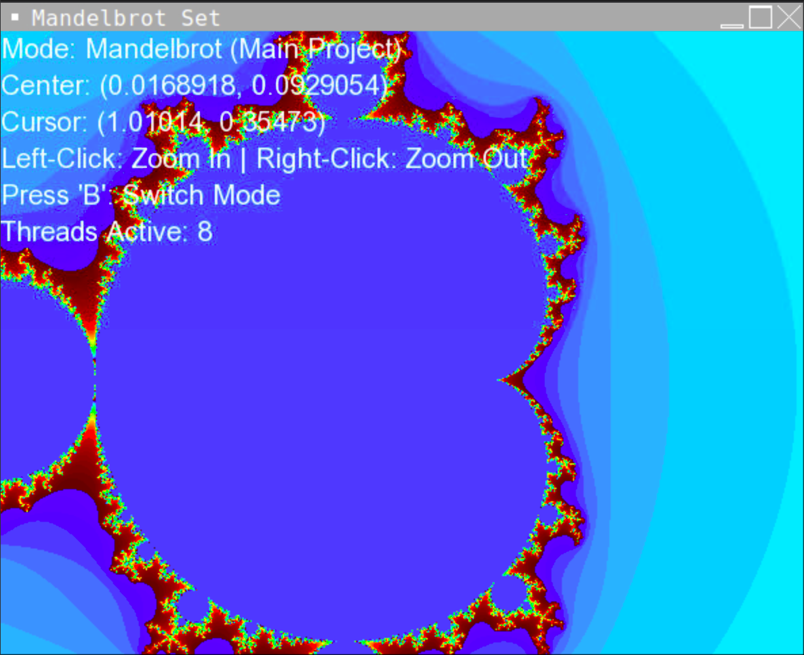
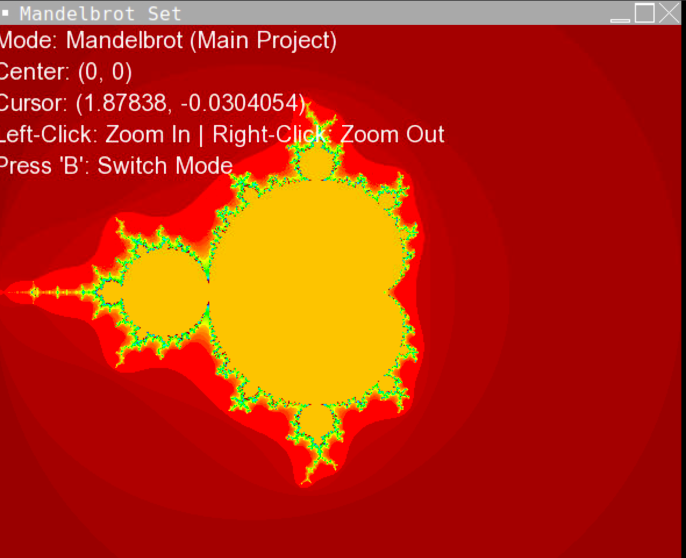

# C++ Multithreaded Mandelbrot Engine

I built this fractal engine to practice C++ multithreading and performance optimization. Instead of just rendering a static image,
I wanted the program to talk to my computer's hardware to see how many CPU cores it could use to speed up the math.
Features
Hardware Detection: I used std::thread::hardware_concurrency() so the program automatically finds your CPU cores. As you can see in the screenshot, it’s currently using 8 threads to do the heavy lifting.
Performance: By splitting the work across different threads, the fractal renders much faster even when I increased the math complexity (set to 256 iterations).
Math & Graphics: The project uses std::complex for the fractal logic and SFML to draw everything to the screen.

Progress & Results
I kept a "before" version of the project to track my progress.
Before Optimization:
This version was single-threaded and used lower iterations, which made the edges look a bit blurry.

Final Version (After):
The final version shown at the top uses all 8 threads and 256 iterations, making the render much sharper and more efficient.

